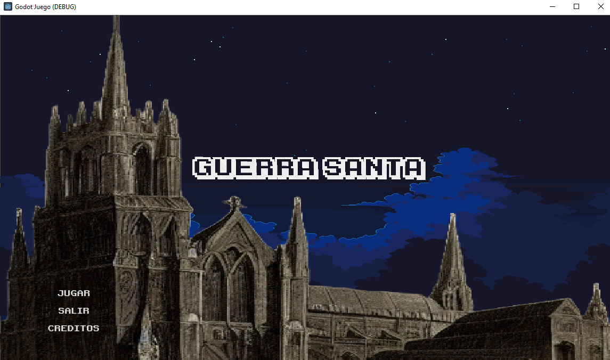
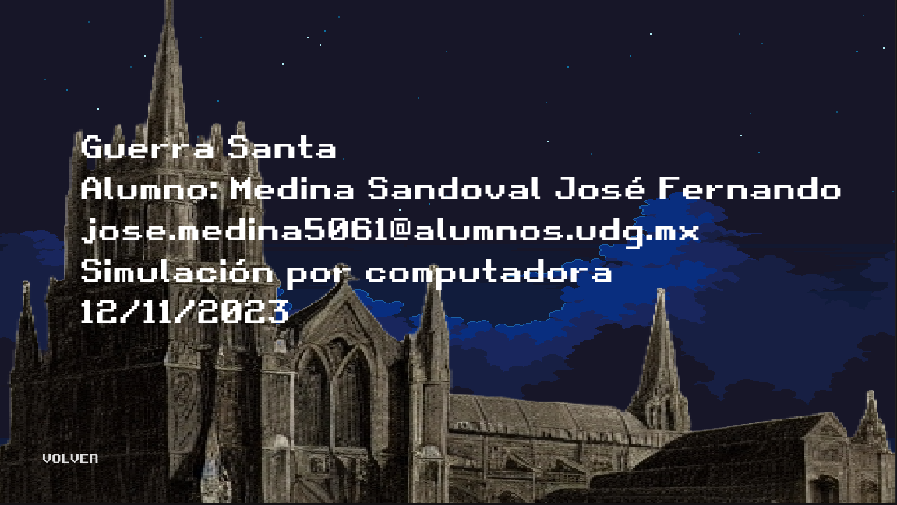
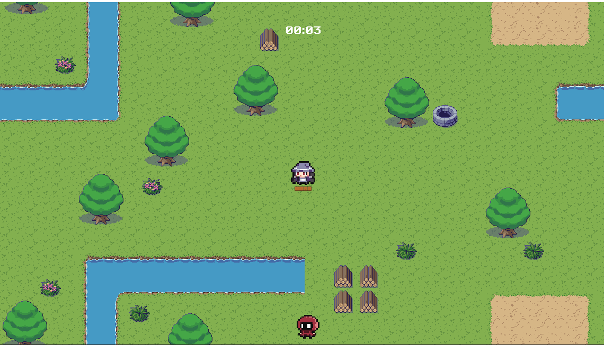
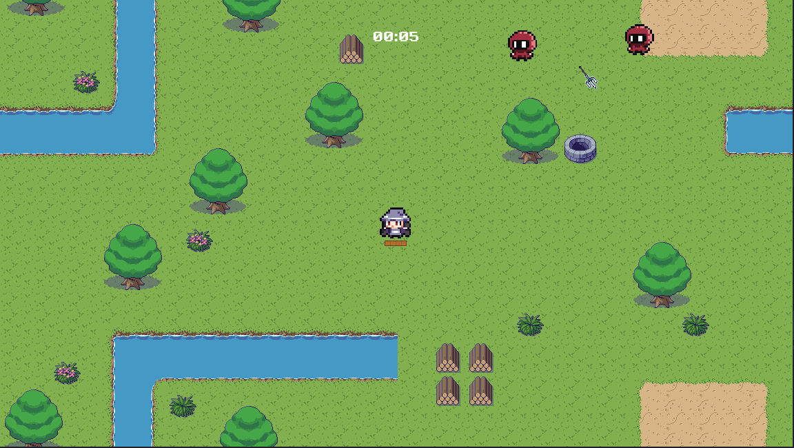
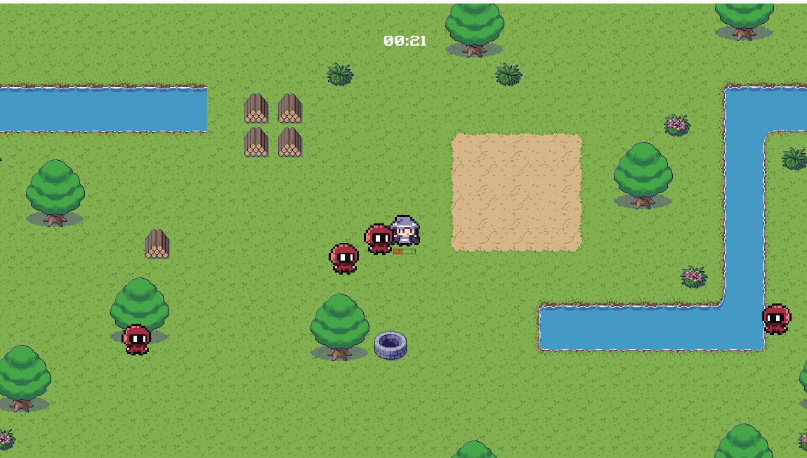

# Practica 07 Mi primera aplicación en un motor grafico 

En esta actividad se desarrolla un juego 2d con el motor Godot, realicé un juego 2d de la temática "survivor 2d", basado en el juego "Vampire Survivors"

## Capturas

Menú inicial, todas las escenas tienen música y sonido

